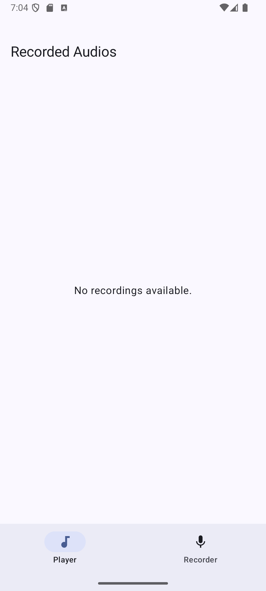
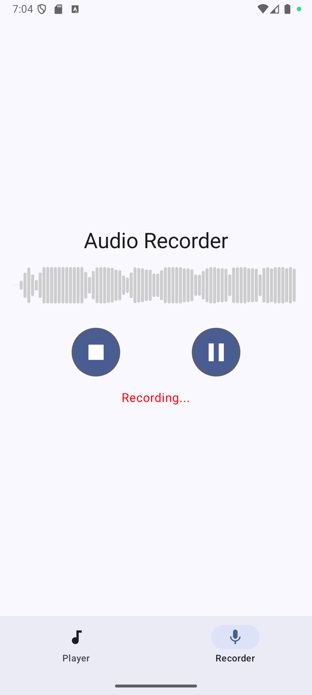
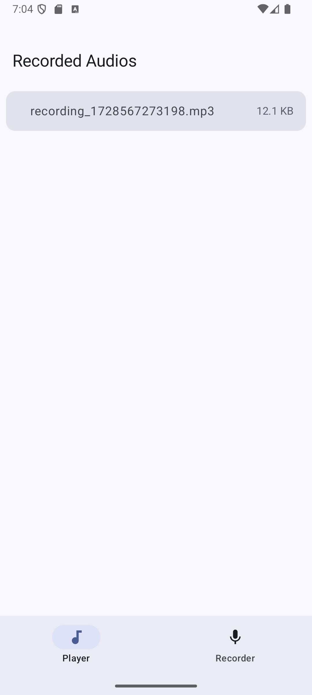

# Audio Player and Recorder with Visualizer

## Overview
This Android application features an audio player and recorder with a real-time bar visualizer. 
Users can play audio files, record sounds via the microphone, and visualize audio levels. 
The app is built using Jetpack Compose, Hilt, Kotlin Coroutines, Flow, and Media3.

## Features
- **Audio Player**: Play and control audio files (.mp3, .wav).
- **Visualizer**: Real-time bar visualizer for both playback and recording.
- **Audio Recorder**: Capture audio with controls to start, pause, and stop.
- **Save Recordings**: Store recorded audio files locally.
- **Playback Recorded Audio**: Listen to recorded audio with visualization.
- **User-Friendly UI**: Intuitive interface for smooth user experience.

## Technologies Used
- **Jetpack Compose**
- **Hilt**
- **Kotlin Coroutines**
- **Flow**
- **Media3**

## Architecture
### The app follows Clean Architecture principles with:
- **Presentation Layer**: Jetpack Compose UI components.
- **Domain Layer**: Business logic and use cases.
- **Data Layer**: Data sources and repositories.

## Demo Video
[Watch the Demo](./sampleMedia/demo_video.webm)

## Sample Screenshots
|  |  |  |
|------------------------------------------|------------------------------------------|------------------------------------------|
| **Screenshot 1**                         | **Screenshot 2**                         | **Screenshot 3**                         |


## Setup Instructions
1. **Clone the Repository**:
   ```bash
   git clone https://github.com/Sharma-Prince/ArtiumDemo.git
   cd ArtiumDemo
##